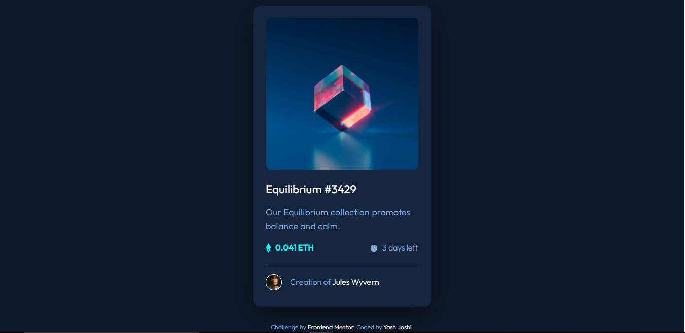
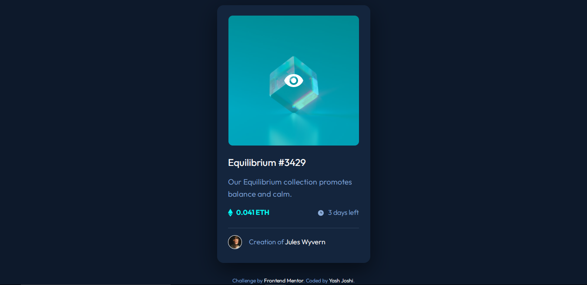

# Frontend Mentor - NFT preview card component solution

This is a solution to the [NFT preview card component challenge on Frontend Mentor](https://www.frontendmentor.io/challenges/nft-preview-card-component-SbdUL_w0U).
## Table of contents

- [Overview](#overview)
  - [The challenge](#the-challenge)
  - [Screenshot](#screenshot)
  - [Links](#links)
- [My process](#my-process)
  - [Built with](#built-with)
  - [Continued development](#continued-development)
  - [Useful resources](#useful-resources)
- [Author](#author)

## Overview

### The challenge

Users should be able to:

- View the optimal layout depending on their device's screen size
- See hover states for interactive elements

### Screenshot

 
 

### Links

- Solution URL: 
- Live Site URL: 

## My process

- Worked on displaying cards as given in the design.
- Added media queries for smaller devices to show optimal layout to the user.

### Built with

- HTML
- CSS
- Flexbox
- Mobile-first workflow

### Continued development

For future projects I need to focus on using more advanced CSS to create effects.

### Useful resources

- [How To Create an Overlay Image Icon](https://www.w3schools.com/howto/howto_css_image_overlay_icon.asp) - This helped me to add an overlay to the image on hover.
- [Using only CSS, show div on hover over another element](https://stackoverflow.com/questions/5210033/using-only-css-show-div-on-hover-over-another-element) - This Stack Overflow question helped me to figure out how to show the view icon on hover.

## Author

- GitHub - Yash Joshi (https://github.com/yashgjoshi20)
- Frontend Mentor - Yash Joshi (https://www.frontendmentor.io/profile/yashgjoshi20)

